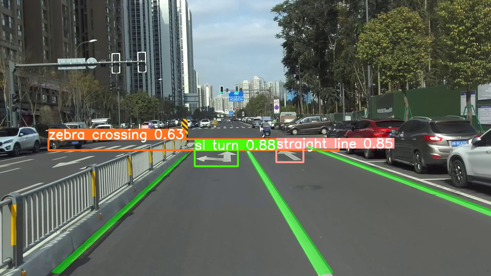

  

# 
:blush::blush::blush:Welcome:blush::blush::blush:

🍄学习参考实现lane line + object🍄

#### 🚀 🚀 🚀 修改食用🚀 🚀 🚀 
| 做了以下修改：                  实现道路目标检测 实现车道线检测 |  
|-------------------------------------------|
| 1.去掉一个分割头(当前为目标检测+车道线分割)                  |
| 2.制作自己的数据(image+lane_seg+obj_detect)      |                 |
| 3.修改nn.task网络，可以愉快的进行迁移学习                 |                 |
| 4.修改多处细节，结合zed深度相机进行                      |                 |
| 4.修改export，可以顺利的导出onnx以及进行推理              |                 |
| 5....                                     |                 |

 

## model
- 待上传
## Reference
- [https://github.com/JiayuanWang-JW/YOLOv8-multi-task](https://github.com/JiayuanWang-JW/YOLOv8-multi-task)
## 
~感谢作者，让我受益匪浅，学到了很多~

